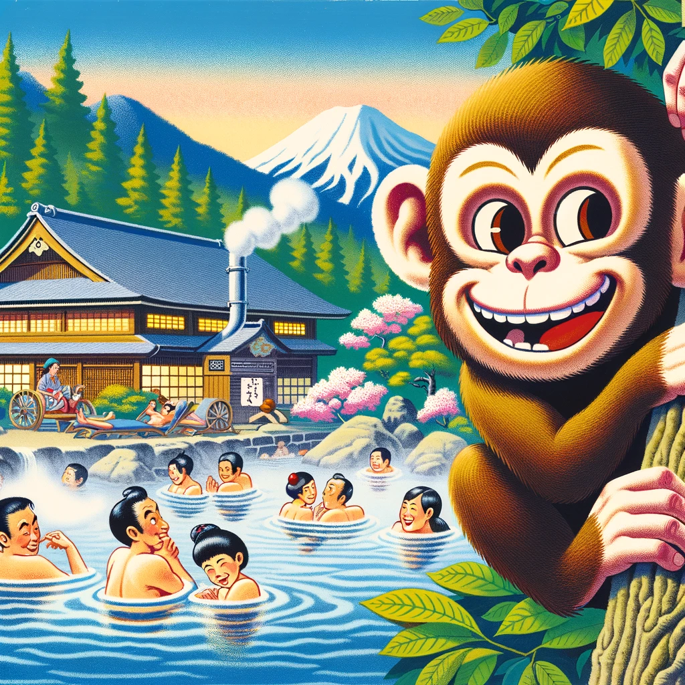

# Ankey

This Godot project aims at making a fun and interactive version of the worldwide used Anki App.

Graphics are made by me or using OpenAI's image generation model.

Players' data are stored in a SQLite database.

Python is used to fill in the database.
