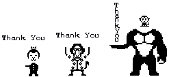

# Ankey

This Godot project aims at making a fun and interactive customizable typing game, inspired by the *Anki App* and *Battle & Get! Pokémon Typing DS*.

Graphics are made by me using Aseprite and OpenAI's image generation model.

Players' data are stored in a SQLite database.

Python is used to fill in the database.

